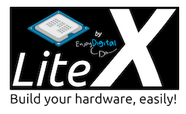

# LiteX



LiteX (prononcer "Lytek") est un outil de conception de FPGA qui peut être utiliser pour créer des processeurs (cores) des "systèmes on ship" (SoC) et des architectures complètes de FPGA.

Voici les liens vers le site du développeur (F Kermarrec)

https://github.com/enjoy-digital/litex

LiteX est un excellent complément à Migen, également disponible sous la forme de bibliothèques Python, LiteX va utiliser la syntaxe Migen pour offrir un ensemble de sous-modules pour faciliter le développement des architectures FPGA.

Voici un extrait de la présentation de LiteX sur son Github:

```
                        +---------------+
                        |FPGA toolchains|
                        +----^-----+----+
                             |     |
                          +--+-----v--+
         +-------+        |           |
         | Migen +-------->           |
         +-------+        |           |        Your design
                          |   LiteX   +---> ready to be used!
                          |           |
+----------------------+  |           |
|LiteX Cores Ecosystem +-->           |
+----------------------+  +-^-------^-+
 (Eth, SATA, DRAM, USB,     |       |
  PCIe, Video, etc...)      +       +
                           board   target
                           file    file
```

## Sub-packages

**litex.gen** Provides specific or experimental modules to generate HDL that are not integrated in Migen.

**litex.build:** Provides tools to build FPGA bitstreams (interface to vendor toolchains) and to simulate HDL code or full SoCs.

**litex.soc:** Provides definitions/modules to build cores (bus, bank, flow), cores and tools to build a SoC from such cores.

**litex.boards:** Provides platforms and targets for the supported boards. All Migen's platforms can also be used in LiteX. The boards present in the LiteX repository are the official ones that are used for development/CI. More boards are available at: https://github.com/litex-hub/litex-boards


Dans notre application, trois choses essentielles sont apportées par LiteX:

- tout d'abord "litex.boards" va nous fournir la base pour notre NEXYS 4 DDR en effet, celle-ci est déjà presque entièrement implémenté et directement disponible dans la bibliothèque.
- Egalement Litex.soc va nous fournir le "PICO RV32", celui-ci étant un des processeurs RISC V déjà présents dans Litex.
- Et enfin, litex.build offre la possibilité d'utiliser et de compiler directement notre architecture en utilisant les drivers de Vivado, mais sans avoir besoin de lancer celui-ci. Tout se fait de manière automatique et de façon transparante pour nous, de la compilation à l'implémentation sur le FPGA.
