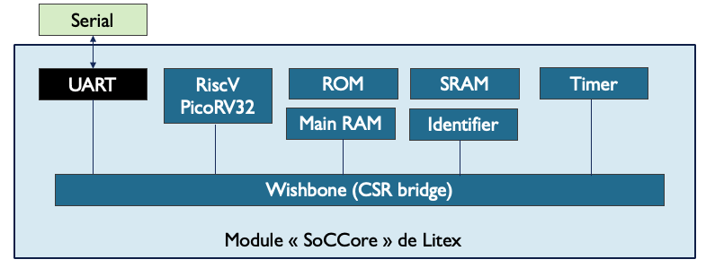
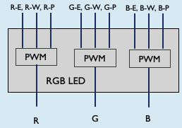
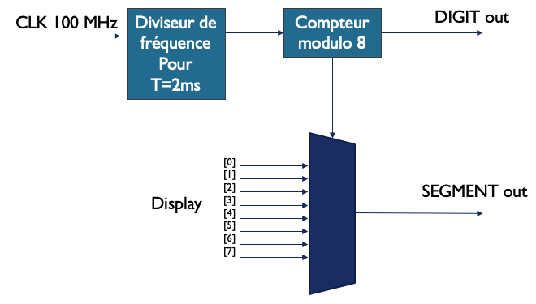
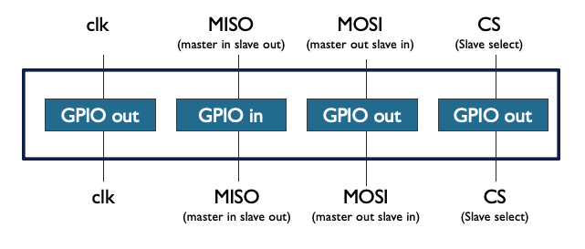
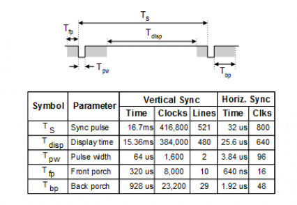
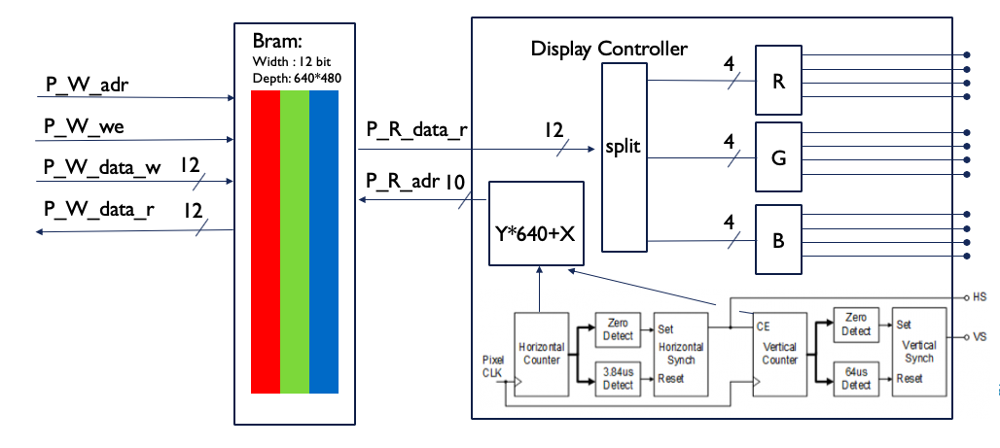

# Description des modules

Voici ci-dessous l'architecture que nous souhaitons implémenter sur notre FPGA. Pour cela nous devons décrire l'ensemble des modules correspondant aux blocs de ce schéma :


## SoCCore

Le module SoCCore tel que initialement proposé par Litex ressemble à ceci :




Après avoir installé LiteX, le fichier décrivant ce module est disponible ici : "./litex/soc/integration/soc_core.py"

Lors de la génération du build, nous l'instancierons en précisant les paramètres souhaités notamment le CPU de type PicoRV32. Nous verrons cela à l'étape suivante.

## GPIOs (LEDs, switchs, buttons)

Pour interfacer les entrées/sorties basiques tels que les LEDs simples, les switchs et les boutons, nous utilisons des modules GPIO disponibles dans la bibliothèque de LiteX : "./litex/soc/cores/gpio.py":

```python
# GPIO Input -------------------------------------------------------------------------------
class GPIOIn(Module, AutoCSR):
    def __init__(self, signal):
        self._in = CSRStatus(len(signal))
        self.specials += MultiReg(signal, self._in.status)

# GPIO Output ------------------------------------------------------------------------------
class GPIOOut(Module, AutoCSR):
    def __init__(self, signal):
        self._out = CSRStorage(len(signal))
        self.comb += signal.eq(self._out.storage)
```

## LEDs RGB

La commande des LEDs RGB est constituée de trois canaux (rouge, vert et bleu). Nous avons donc créé un module regroupant ces trois canaux. 



Afin de pouvoir moduler individuellement chacun des canaux, nous avons utilisé le module PWM de LiteX : "./litex/soc/cores/pwm.py". Le module se pilote via ses trois entrées Enable, Width et Period

Voici notre module faisant appel aux PWM: [module/rgbled.py](../DEV/module/rgbled.py)

```python
from migen import *
from migen.genlib.cdc import MultiReg
from litex.soc.interconnect.csr import *
from litex.soc.cores import pwm

# RGB LED ---------------------------------------------------------------------------
class RGBLed(Module, AutoCSR):
    def __init__(self, pads):
        self.submodules.r = pwm.PWM(pads.r)
        self.submodules.g = pwm.PWM(pads.g)
        self.submodules.b = pwm.PWM(pads.b)
```

## 7 segments

Ce module permet d'interagir avec les 8 pavés de 7 segments de la Nexys4DDR. LiteX ne proposant aucune définition pour ce type de module, nous l'avons donc réalisé de la façon suivante :




Ce schéma fonctionnel est décrit via les fonctions de Migen, en particulier par l'usage de self.sync pour synchroniser sur les coups d'horloge de 100Mhz et de self.comb qui permet de définir les liaisons combinatoires. Ce module est disponible ici : [module/sevensegment.py](../DEV/module/sevensegment.py)

```python
from migen import *
from migen.genlib.cdc import MultiReg

from litex.soc.interconnect.csr import *

# Seven Segment ---------------------------------------------------------------------------

class SevenSegment(Module, AutoCSR):
    def __init__(self, segment_out, digit_out):
        
        nb_dig = len(digit_out)
        dgt_count = Signal(max = nb_dig)
    
        refresh_period = 16*10**(-3)  # refresh of 16ms (from datasheet)
        digit_period = refresh_period/nb_dig # period for 1 digit
        
        dgt_tick = Signal()
        dgt_tick_count = Signal(max = int(digit_period*100e6))
        
        self.displays = Array(Signal(len(segment_out)) for i in range(nb_dig))
        
    # CSR -----------------------------------------------------------------------------
    
        self._dig_0 = CSRStorage(8)
        self._dig_1 = CSRStorage(8)
        self._dig_2 = CSRStorage(8)
        self._dig_3 = CSRStorage(8)
        self._dig_4 = CSRStorage(8)
        self._dig_5 = CSRStorage(8)
        self._dig_6 = CSRStorage(8)
        self._dig_7 = CSRStorage(8)
        
        self.comb += [
            self.displays[0].eq(self._dig_0.storage),
            self.displays[1].eq(self._dig_1.storage),
            self.displays[2].eq(self._dig_2.storage),
            self.displays[3].eq(self._dig_3.storage),
            self.displays[4].eq(self._dig_4.storage),
            self.displays[5].eq(self._dig_5.storage),
            self.displays[6].eq(self._dig_6.storage),
            self.displays[7].eq(self._dig_7.storage)
        ]
    
        # # #
        
        self.sync += [
            # Digit tick counter
            If(dgt_tick_count >= int(digit_period*100e6-1),
                dgt_tick_count.eq(0),
                dgt_tick.eq(1)
            ).Else(
                dgt_tick_count.eq(dgt_tick_count + 1),
                dgt_tick.eq(0)
            ),
            # Digit counter
        If(dgt_tick,
            If(dgt_count >= nb_dig-1,
            dgt_count.eq(0)
        ).Else(
            dgt_count.eq(dgt_count + 1)
        )
        )
        ]
        
        self.comb += [
        # digit_out
            digit_out.eq(~(1<<dgt_count)),
            # segment_out
        segment_out.eq(~self.displays[dgt_count])
        ]

```

## Joystick

Le joystick est raccorder à une interface SPI. Sa documentation est disponible ici: PmodJSTK2 Manual: https://reference.digilentinc.com/_media/reference/pmod/pmodjstk2/pmodjstk2_rm.pdf. Etant donné que nous utilisons un processeur, il n'est pas obligatoire de gérer le module de liaison SPI par le FPGA.

Nous avons ainsi simplifié son interface en utilisant les GPIO de Litex (comme vu précédemment) et donné la gestion de la liaison SPI à notre processeur au travers du firmware.



Ce module est disponible ici : [module/spijoystick.py](../DEV/module/spijoystick.py)

```python
from migen import *
from migen.genlib.cdc import MultiReg
from litex.soc.interconnect.csr import *

#  SpiJoystick ---------------------------------------------------------------------------
""" SpiJoystick est interfacé sur un port Pmod
"""

class SpiJoystick(Module,AutoCSR):
	def __init__(self, pads):
	# Clock generation -------------------------------------------------------------------------
		self._clk = CSRStorage()
		self.comb += pads.clk.eq(self._clk.storage)
	# Chip Select generation -------------------------------------------------------------------
		self._cs = CSRStorage(reset=1)
		self.comb += pads.cs_n.eq(self._cs.storage)
	# Master Out Slave In (MOSI) generation ----------------------------------------------------
		self._mosi = CSRStorage()
		self.comb += pads.mosi.eq(self._mosi.storage)
	# Master In Slave Out (MISO) capture -------------------------------------------------------
		self._miso = CSRStatus()
		self.comb += self._miso.status.eq(pads.miso)
```

## VGA controller

Comme pour les autres modules, nous nous sommes appuyés sur le descriptif de la Nexys4DDR : https://reference.digilentinc.com/reference/programmable-logic/nexys-4-ddr/reference-manual pour comprendre et implémenter le "display controler block", et en particulier les temps en référence pour définir la synchro verticale et horizontale pour un affichage en 640*480pixels :



Il a également été nécessaire de créer une B-RAM afin d'avoir un buffer entre notre processeur et le VGA controler en lui même. Pour ce faire nous avons donc utilisé la fonction "mem = Memory(memory_width, h_rez*v_rez)" de Migen.

Voici l'architecture de notre module:




Ce module est disponible ici : [module/vgacontroller.py](../DEV/module/vgacontroller.py)

```python
from migen import *
from migen.genlib.cdc import MultiReg

from litex.soc.interconnect.csr import *

# VGA Controller ---------------------------------------------------------------------------

class VGAcontroller(Module, AutoCSR):
    """VGA display controller
    
    Provides a video controller circuit to drive the sync and color signals with the correct timing
    in order to produce a working display system.
    """
    def __init__(self, hs, vs, r_out, g_out, b_out):
        h_rez = 640
        h_startsync = 640 + 16
        h_endsync = h_startsync + 96
        h_max = 800
        h_count = Signal(max = h_max)
        
        v_rez = 480
        v_startsync = 480 + 10
        v_endsync = v_startsync + 2
        v_max = 525
        v_count = Signal(max = v_max)
    
        pxl_freq = 25e6 # pixel counter frequency 25MHz
        pxl_tick_count = Signal(max = int(100e6/pxl_freq))
        pxl_tick = Signal()
        
        active = Signal()
        
        memory_width = len(r_out)+len(g_out)+len(b_out)
        mem = Memory(memory_width, h_rez*v_rez)
        self.specials += mem
        
        p_r = mem.get_port()
        p_w = mem.get_port(write_capable=True)
        self.specials += p_r, p_w
    
        # CSR -----------------------------------------------------------------------------
        self._mem_adr = CSRStorage(len(p_w.adr))
        self._mem_we = CSRStorage(len(p_w.we))
        self._mem_data_w = CSRStorage(memory_width)
        self._mem_data_r = CSRStatus(memory_width)
        
        self.comb += [
            p_w.adr.eq(self._mem_adr.storage),
            p_w.we.eq(self._mem_we.storage),
            self._mem_data_r.status.eq(p_w.dat_r),
            p_w.dat_w.eq(self._mem_data_w.storage)
        ]
    
        # # #
        
        self.sync += [
        # Pxl clock generation
        If(pxl_tick_count >= (3),
            pxl_tick_count.eq(0),
            pxl_tick.eq(1)
        ).Else(
            pxl_tick_count.eq(pxl_tick_count + 1),
            pxl_tick.eq(0)
            ),
        
        # Horiontal and vertical counters
        If(pxl_tick,
            If(h_count >= h_max -1,
            h_count.eq(0),
            If(v_count >= v_max -1,
                v_count.eq(0)
            ).Else(
            v_count.eq(v_count+1)
            )
        ).Else(
            h_count.eq(h_count+1)
        )
        ),
        
        # Adress read sync
        p_r.adr.eq(v_count*h_rez+h_count)
        ]

        self.comb += [
            # h sync
        hs.eq((h_count >= h_startsync) & (h_count < h_endsync)),
        # v sync
        vs.eq((v_count >= v_startsync) & (v_count < v_endsync)),
        # display sync
        active.eq((h_count < h_rez) & (v_count < v_rez)),
        # red out
        r_out.eq(active * p_r.dat_r[0:4]),
        # green out
        g_out.eq(active * p_r.dat_r[4:8]),
        # blue out
        b_out.eq(active * p_r.dat_r[8:12])
        ]
```

