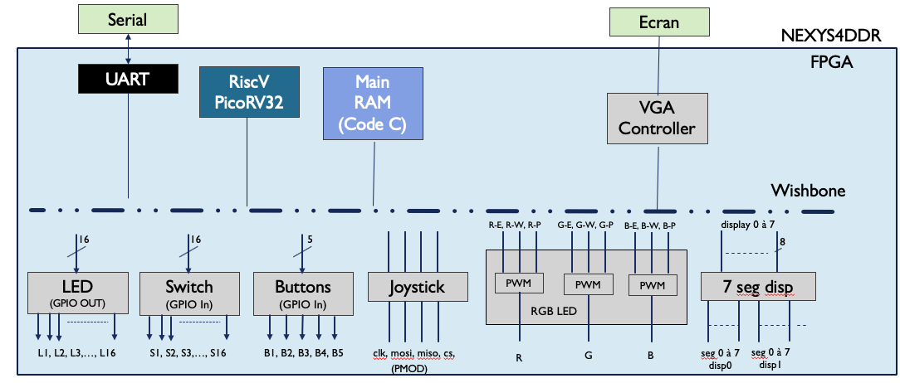
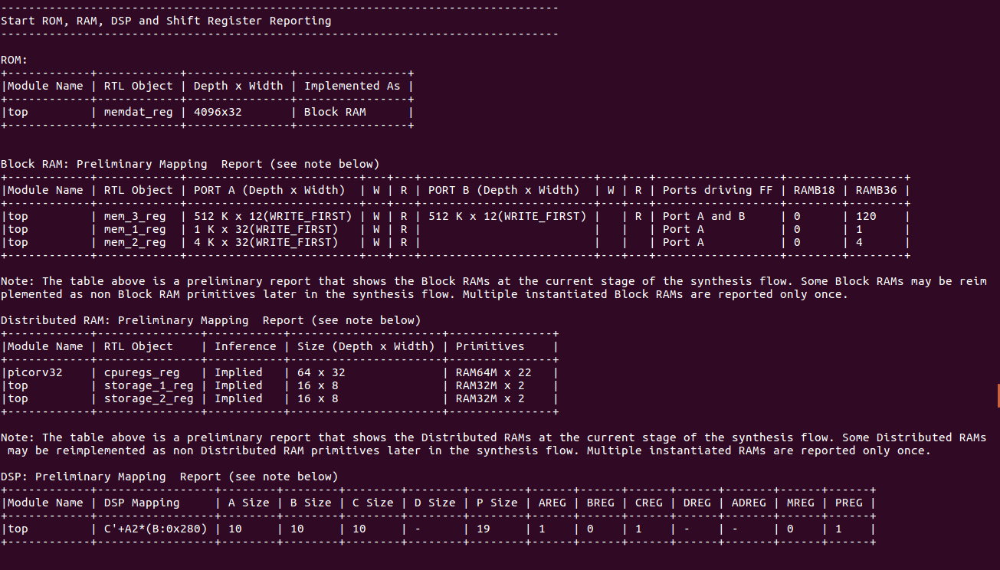

# BuildNexys4ddr.py

Comme nous avons pu le voir précédemment, voici le schéma architecturel du FPGA:


Une fois le fonctionnement des modules décris, il faut pouvoir les instancier conformément à l'architecture souhaitée. C'est ce qui est fait dans le fichier "./buildNexys4ddr.py".

Premièrement, nous instancions le module SocCore. Pour cela, nous précisons les paramètres utiles: 
- la plateforme, celle de la Nexys4ddr
- le type de CPU, un PicoRV32 conformément au choix effectué lors de la première étape
- la fréquence d'horloge de 100MHz, relative à l'horloge présente sur la carte
- la taille de la ROM intégrée à 4096o 
- la taille de la RAM principale à 2048o
Pour informations, certains paramètres sont déjà précisé par défaut tels que les paramètres du CSR et de l'UART.
```python
class BaseSoC(SoCCore):
	def __init__(self):
		platform = nexys4ddr.Platform()
		# SoC with CPU
		SoCCore.__init__(self, platform,
 			cpu_type="picorv32",
			clk_freq=100e6,
			integrated_rom_size=0x8000,
			integrated_main_ram_size=16*1024)
```
Par la suite, nous instancions tous les autres modules et les relions avec les pins correspondants définis dans la plateforme
Pour expliquer la démarche, prenons l'exemple des LEDs. D'abord, on ajoute un CSR afin de préciser l'ajout d'un sous-module. Ensuite on recherche les pins correspondant aux 16 LEDs dans la plateforme. Petit astuce, on les concatène afin d'obtenir un mot de 16bits. Et enfin, on défini le sous-module ajouté comme étant un module GPIO_Out avec en paramètre le mot de 16bits comprenant les 16 pins des LEDs de la plateforme.
```python
	# Leds
	SoCCore.add_csr(self,"leds")
	user_leds = Cat(*[platform.request("led", i) for i in range(16)])
	self.submodules.leds = gpio.GPIOOut(user_leds)
```
Nous procédons de même pour chacun des modules.
```python
	# Clock Reset Generation
	self.submodules.crg = CRG(platform.request("clk100"), ~platform.request("cpu_reset"))

	# Leds
	SoCCore.add_csr(self,"leds")
	user_leds = Cat(*[platform.request("led", i) for i in range(16)])
	self.submodules.leds = gpio.GPIOOut(user_leds)

	# Switchs
	SoCCore.add_csr(self,"switchs")
	user_switchs = Cat(*[platform.request("sw", i) for i in range(16)])
	self.submodules.switchs = gpio.GPIOIn(user_switchs)

	# Buttons
	SoCCore.add_csr(self,"buttons")
	user_buttons = Cat(*[platform.request("btn%c" %c) for c in ['c','d','u','r','l']])
	self.submodules.buttons = gpio.GPIOIn(user_buttons)

	# RGB leds
	SoCCore.add_csr(self,"led16")
	self.submodules.led16 = rgbled.RGBLed(platform.request("led",16))

	SoCCore.add_csr(self,"led17")
	self.submodules.led17 = rgbled.RGBLed(platform.request("led",17))

	# 7segments Display
	SoCCore.add_csr(self,"display")
	display_segments = Cat(*[platform.request("display_segment", i) for i in range(8)])
	display_digits = Cat(*[platform.request("display_digit", i) for i in range(8)])
	self.submodules.display = sevensegment.SevenSegment(display_segments,display_digits)

	# Joystick SPI
	SoCCore.add_csr(self,"joystick")
	self.submodules.joystick = spijoystick.SpiJoystick(platform.request("joystick"))

	# VGA
	SoCCore.add_csr(self,"vga_cntrl")
	vga_red = Cat(*[platform.request("vga_red", i) for i in range(4)])
	vga_green = Cat(*[platform.request("vga_green", i) for i in range(4)])
	vga_blue = Cat(*[platform.request("vga_blue", i) for i in range(4)])
	self.submodules.vga_cntrl = vgacontroller.VGAcontroller(platform.request("hsync"),platform.request("vsync"), vga_red, vga_green, vga_blue)
```

Une fois les modules et sous-modules architecturé dans le FPGA, on build le tout afin de générer le bitstream implementable sur la carte.
```python
# Build --------------------------------------------------------------------------------------------
if __name__ == "__main__":
	builder = Builder(BaseSoC())
	builder.build()
```
Lors de l'execution de ce fichier python, certaines informations nous parviennent en ligne de commande sur la définition architecturelle du FPGA. Cela permet ainsi de vérifier de la cohérence du bitstream généré avec le schéma architecurel souhaité. Une des informations des plus nécessaires est la répartition des mémoires du Soc. La capture d'écran ci-dessous nous montre cette répartition : 


